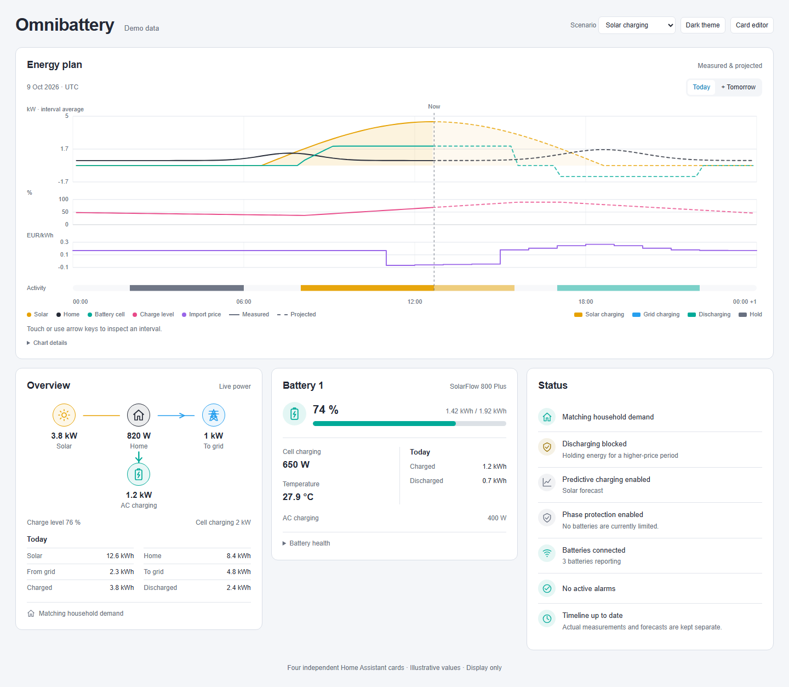
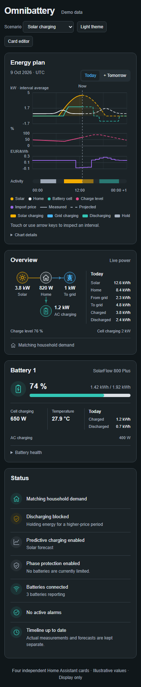

# Omnibattery Cards

Four compact, display-only Home Assistant dashboard cards for [Omnibattery](https://github.com/ffunes/Omnibattery), inspired by the energy dashboards in [EMHASS HA Companion](https://github.com/smefa/emhass-ha-companion).

| Card | What it shows |
| --- | --- |
| **Energy plan** | Solar, consumption, charge level, battery activity, and optional prices on a shared timeline. Measured values and forecasts remain distinct. |
| **Overview** | Live energy flow, battery charge level, operating status, and today's energy totals. |
| **Battery** | One battery's charge level, stored energy, AC and cell power, temperature, daily totals, and available health metrics. |
| **Status** | Charging and discharging blockers, predictive charging, reserves, connectivity, alarms, protections, and timeline freshness. |

Cards follow the active Home Assistant theme. They can open entity details, but contain no battery-control buttons and make no service calls. There are no external runtime assets or dependencies on other custom cards.





## Requirements

- Home Assistant **2026.10 or newer**.
- [Omnibattery](https://github.com/ffunes/Omnibattery) **1.5.0** with its entities enabled. Other versions may work if they retain the same entity and timeline interfaces.
- HACS for the recommended installation, or access to your Home Assistant `www` directory for manual installation.
- Optional: a Nord Pool price sensor exposing timestamped `raw_today` and `raw_tomorrow` attributes.

## Install with HACS

1. Open **HACS → ⋮ → Custom repositories**.
2. Add `https://github.com/thomasvt1/omnibattery-cards` with type **Dashboard**.
3. Find **Omnibattery Cards**, download the latest release, then reload the browser.
4. In your dashboard, choose **Edit → Add card**, then search for **Omnibattery**.

HACS normally adds the JavaScript module resource automatically. If the cards are missing, check **Settings → Dashboards → ⋮ → Resources** for `/hacsfiles/omnibattery-cards/omnibattery-cards.js` with type **JavaScript module**. An existing URL with a `hacstag` query is valid; do not add a duplicate.

This is a HACS custom repository. It is not part of HACS's default catalog. See the [HACS custom repository instructions](https://www.hacs.xyz/docs/faq/custom_repositories/) for help.

### Manual installation

Download `omnibattery-cards.js` from the [latest release](https://github.com/thomasvt1/omnibattery-cards/releases/latest), place it in `config/www/omnibattery-cards/`, and add `/local/omnibattery-cards/omnibattery-cards.js` as a **JavaScript module** dashboard resource. Reload the browser after replacing the file during upgrades.

## Configure

Use the visual editor to select the installation, battery, and optional data sources. Empty entity fields enable automatic discovery. The cards use integration membership and stable registry metadata, so renaming an entity does not break discovery. Legacy `marstek_venus` identifiers are supported.

With a single Omnibattery installation, the smallest configuration is:

```yaml
type: custom:omnibattery-overview-card
```

Add each card independently, or start with the [example dashboard](examples/dashboard.yaml). The cards support both Sections and Masonry dashboards.

```yaml
type: custom:omnibattery-plan-card
title: Energy plan
show_extension: true
import_price_entity: sensor.your_import_price
```

```yaml
type: custom:omnibattery-battery-card
title: Garage battery
battery: YOUR_HOME_ASSISTANT_DEVICE_ID
```

Select a battery in the visual editor to fill its device ID. Repeat the Battery card for each device. The ID is a Home Assistant device-registry ID, not an entity ID, IP address, or battery name.

### Common options

| Option | Type | Default | Description |
| --- | --- | --- | --- |
| `type` | string | Required | One of the four card types listed below. |
| `title` | string | Card title | An optional custom heading. |
| `integration_id` | string | Automatic | Omnibattery config-entry ID. Select it in the editor if you have multiple installations. |
| `entities` | mapping | Automatic | Override individual sources using the role names below. |
| `grid_inverted` | boolean | Integration setting | Set `true` when your selected grid sensor is positive for export. |
| `battery` | string | Automatic | Battery device ID for the Battery card. |
| `import_price_entity` | string | None | Optional timestamped import-price source for the Energy plan. |
| `export_price_entity` | string | None | Optional explicit export-price source for the Energy plan. |
| `show_extension` | boolean | `false` | Initially show available next-day timeline data on the Energy plan. The card also has a range selector. |

Card types:

- `custom:omnibattery-plan-card`
- `custom:omnibattery-overview-card`
- `custom:omnibattery-battery-card`
- `custom:omnibattery-status-card`

### Entity overrides

Overrides take precedence over discovery. Use entity IDs exactly as they appear in Home Assistant.

```yaml
type: custom:omnibattery-overview-card
entities:
  grid: sensor.your_grid_power
  solar: sensor.your_total_solar_power
  home: sensor.your_home_consumption
grid_inverted: false
```

Supported roles:

| Group | Role names |
| --- | --- |
| Sources | `grid`, `solar`, `home`, `timeline` |
| System battery | `soc`, `stored`, `capacity`, `cellPower`, `acPower`, `chargePower`, `dischargePower` |
| System status | `status` |
| Daily energy | `dailySolar`, `dailyHome`, `dailyGridImport`, `dailyGridExport`, `dailyCharge`, `dailyDischarge` |
| Selected battery | `batterySoc`, `batteryStored`, `batteryCapacity`, `batteryCellPower`, `batteryAcPower`, `batteryTemperature`, `batteryDailyCharge`, `batteryDailyDischarge` |

Power sources support W and kW; energy sources support Wh and kWh. Explicit `cellPower`, `acPower`, `batteryCellPower`, and `batteryAcPower` overrides must be positive when charging and negative when discharging. Automatically discovered entities have their driver-specific signs normalized. `chargePower` and `dischargePower` are separate, positive AC magnitudes.

AC exchange and battery-cell power are different measurements. Solar charging can increase cell power without importing power from the grid. Select the complete solar source: the cards do not add individual MPPT values to it.

### Prices and timeline

Price sensors must supply arrays of `{start, end, value}` objects in `raw_today` and, when available, `raw_tomorrow`. Start and end values are timestamps with timezone information. Negative prices are preserved. Missing tomorrow prices stay missing; export prices are displayed only when explicitly configured.

The timeline reads Omnibattery's schema 1 data, including its next-day extension. Its power values are interval averages derived from energy and measured coverage, rather than instantaneous readings. Measured history remains separate from projections; gaps, partial intervals, and daylight-saving changes are preserved. Turning predictive charging off does not remove available profile forecasts.

The single Activity strip uses amber for solar charging, blue for grid charging, teal for discharging, and gray for supported Hold periods. Lighter blocks are projected. Split colors mean multiple activities were reported within a quarter, without implying their order or duration. Unfilled intervals do not imply Hold; that state requires explicit observation or delay evidence.

Use a pointer or touch to inspect the chart. Keyboard users can focus the chart and move through intervals with the arrow keys. Labels use Home Assistant's locale and timezone.

## Missing or unexpected data

- **No installation found:** verify Omnibattery is loaded, select an installation, or enter source overrides.
- **An optional metric is missing:** the device may not support it, its entity may be disabled, or its state may be unavailable. Unsupported values are omitted rather than filled with zeros.
- **Timeline unavailable:** enable Omnibattery's daily operation timeline sensor and check its state and attributes. Unsupported schemas are reported instead of guessed.
- **Stale forecast:** inspect the timeline's generation time and Omnibattery status. Historical measurements remain visible.
- **Wrong grid direction:** check the integration's grid direction or set `grid_inverted` for the selected source.
- **Cards unavailable after an upgrade:** verify the module resource and reload the browser cache. Remove any duplicate resource entries.

## Development

Use Node.js 24 and npm:

```sh
npm ci
npm run dev
npm run check
npm test
npm run build
npx playwright install chromium
npm run test:browser
```

The build produces one self-contained `dist/omnibattery-cards.js`. Demo fixtures use synthetic names and data; do not commit household identifiers, private Home Assistant URLs, credentials, or raw diagnostics.

CI checks types, unit tests, the production build, and browser tests. To release, update `package.json` and the lockfile version together, add a changelog entry, and push a matching `vX.Y.Z` tag. The release workflow verifies the version, runs checks, builds, and attaches `omnibattery-cards.js` to a GitHub release for HACS.

## Credits and license

Omnibattery Cards is an independent frontend project. [Omnibattery](https://github.com/ffunes/Omnibattery) supplies the battery integration and telemetry. [EMHASS HA Companion](https://github.com/smefa/emhass-ha-companion) inspired the compact dashboard layout and timeline presentation. Home Assistant and HACS provide the dashboard and distribution platforms.

Licensed under [GNU AGPL version 3 or later](LICENSE). The frontend uses Lit, distributed under its BSD 3-Clause license; dependency notices are retained in the build where applicable. The cards do not implement energy optimization or hardware control.
